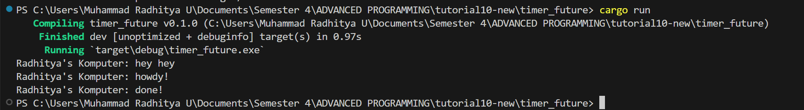

# MODULE 10

## 1.2. Understanding how it works.

In rust, after spawning the task of "howdy" it doesn't immediately run, it has to be called or "executed" by another code. In this case it is called by `drop(spawner)` and  `executor.run();`, both of which runs after `println!("Radhitya's Komputer: hey hey");`. future in rust are inert/lazy meaning they won't do anything unless called or actively driven to completion. After hey hey is printed then is runs howdy! -> 2 sec delay -> done!. So in conclusion The asynchronous task of "howdy" is scheduled for execution when spawned but doesn't immediately run. Instead, it waits in the task queue until the executor runs it, which occurs after `("Radhitya's Komputer: hey hey")` is printed, resulting in the delayed execution sequence.