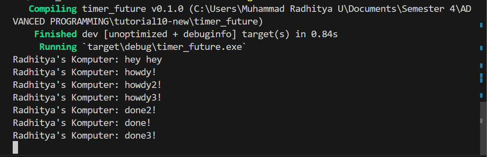
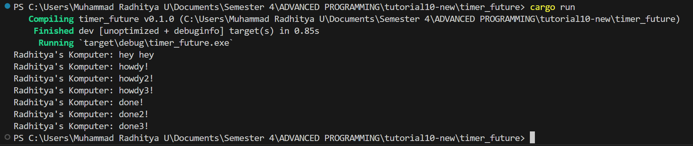

# MODULE 10

## 1.2. Understanding how it works.

In rust, after spawning the task of "howdy" it doesn't immediately run, it has to be called or "executed" by another code. In this case it is called by `drop(spawner)` and  `executor.run();`, both of which runs after `println!("Radhitya's Komputer: hey hey");`. future in rust are inert/lazy meaning they won't do anything unless called or actively driven to completion. After hey hey is printed then is runs howdy! -> 2 sec delay -> done!. So in conclusion The asynchronous task of "howdy" is scheduled for execution when spawned but doesn't immediately run. Instead, it waits in the task queue until the executor runs it, which occurs after `("Radhitya's Komputer: hey hey")` is printed, resulting in the delayed execution sequence.

## 1.3. Multiple Spawn and removing drop

1. Without Drop

The program runs endlessly without stopping

2. With Drop

The program ends eventually as usual

As in the screenshots, the cargo run without Drop will run endlessly.  This is because the `drop()` method in rust is used to release a resource that is no longer needed. In this example `drop(spawner);`, it is used to release the `spawner` that has been made earlier containing the future howdys and dones. Because it is not dropped the program still assumes it's going to be used in the future, thus not stopping. Releasing unneeded resource like this ensures that the executor doesn't wait indefinitely for new tasks to arrive, preventing potential resource leaks or unnecessary resource consumption.